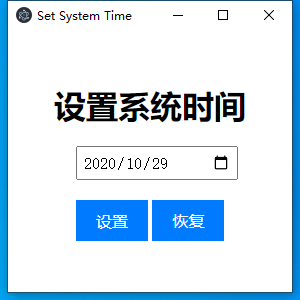

# 修改系统时间小工具

## 1. 介绍

开发这个小工具的原因是因为在使用一个软件的时候，发现这个软件的证书授权时间是根据系统时间来判断的，所以就想到了修改系统时间的方法，但是每次都要打开控制面板，然后找到时间设置，然后修改，然后关闭，感觉很麻烦，并且在使用浏览器百度时，如果系统时间不是北京时间，也无法访问网页，所以就开发了这个小工具，可以快速修改系统时间，而且可以恢复时间为北京时间，方便使用。

## 2. 使用方法

如图所示，点击设置按钮即可修改系统时间，点击恢复按钮即可恢复系统时间为北京时间。



## 3. 编译

### 运行

```bash
npm install
npm start
```

### 打包

```bash
npm run make
```

## 4. 下载

[下载地址](https://github.com/Flashowing/SetSystemTime/releases)

